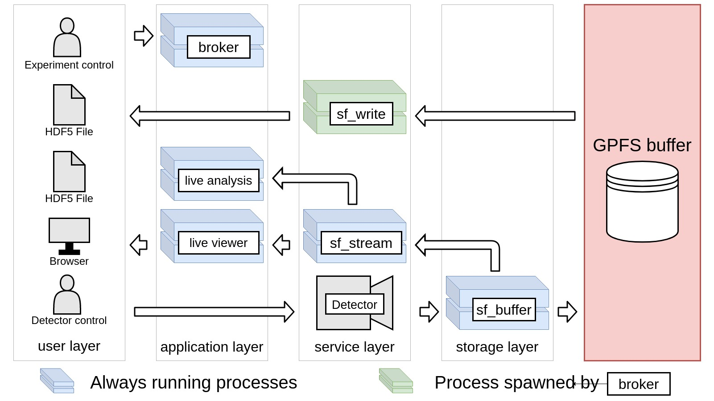

# sf_daq_buffer

Overview of current architecture and component interaction.



## Useful links

- Hyperslab selection 
https://support.hdfgroup.org/HDF5/Tutor/phypecont.html
- Intro to lock free programming
https://preshing.com/20120612/an-introduction-to-lock-free-programming/
- POSIX compliant write order test on GPFS
https://svn.hdfgroup.org/hdf5/branches/hdf5_1_10_0/test/POSIX_Order_Write_Test_Report.pdf
- Best Practice Guide - Parallel I/O
https://prace-ri.eu/wp-content/uploads/Best-Practice-Guide_Parallel-IO.pdf
- MPI-IO/GPFS, an Optimized Implementationof MPI-IO on top of GPFS
https://ieeexplore.ieee.org/stamp/stamp.jsp?tp=&arnumber=1592834
- JSON library benchmarks
https://github.com/miloyip/nativejson-benchmark
- Tuning CPU scheduler for reducing latency
https://www.scylladb.com/2016/06/10/read-latency-and-scylla-jmx-process/
- Low latency 10Gbps Ethernet
https://blog.cloudflare.com/how-to-achieve-low-latency/
- CFS intro
https://opensource.com/article/19/2/fair-scheduling-linux


## Build

To compile this repo you will need to install the following packages on RH7:
- devtoolset-9
- cmake3
- zeromq-devel
- hdf5-devel

```bash
yum install devtoolset-9
yum install cmake3
yum install zeromq-devel
yum install hdf5-devel
yum install jsoncpp-devel
```

Step by step procedure to build the repo:

```bash
scl enable devtoolset-9 bash
git clone https://github.com/paulscherrerinstitute/sf_daq_buffer.git
cd sf_daq_buffer
mkdir build
cd build/
cmake3 ..
make
```

It is recommended to create symbolic links to the executables you will be using 
inside your PATH.

Example:
```bash
ln -s "$(pwd)""/""sf_buffer" /usr/bin/sf_buffer
ln -s "$(pwd)""/""sf_stream" /usr/bin/sf_stream
ln -s "$(pwd)""/""sf_replay" /usr/bin/sf_replay
ln -s "$(pwd)""/""sf_writer" /usr/bin/sf_writer
```
