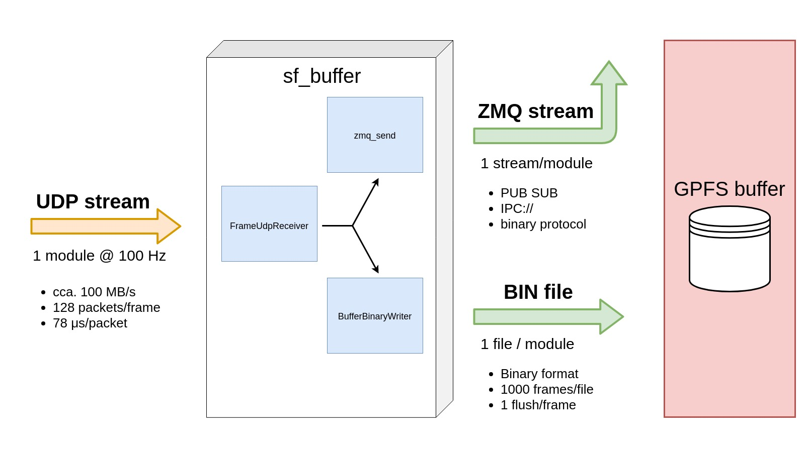
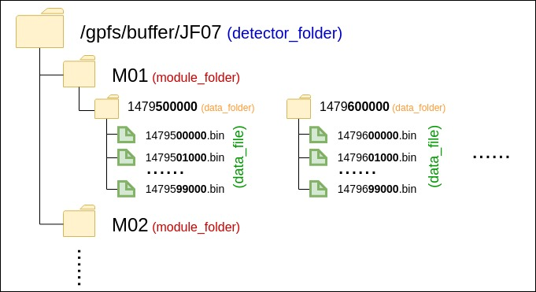

# sf-buffer
sf-buffer is the component that receives the detector data in form of UDP 
packages and writes them down to disk to a binary format. In addition, it 
sends a copy of the module frame to sf-stream via ZMQ.

Each sf-buffer process is taking care of a single detector module. The 
processes are all independent and do not rely on any external data input 
to maximize isolation and possible interactions in our system.

The main design principle is simplicity and decoupling:

- No interprocess dependencies/communication.
- No dependencies on external libraries (as much as possible).
- Using POSIX as much as possible.

We are optimizing for maintainability and long term stability. Performance is 
of concern only if the performance criteria are not met.

## Overview



### UDP receiving

### File writing

Files are written to disk in "frame" bunches - each frame is first assembled 
from multiple received packets, and then written to disk as a block. This is 
the complete frame from one module (module assembly is done in the 
writer).

#### File format

The binary file on disk is just a serialization of multiple 
**BufferBinaryFormat** structs:
```c++
#pragma pack(push)
#pragma pack(1)
struct ModuleFrame {
    uint64_t pulse_id;
    uint64_t frame_index;
    uint64_t daq_rec;
    uint64_t n_recv_packets;
    uint64_t module_id;
};
#pragma pack(pop)

#pragma pack(push)
#pragma pack(1)
struct BufferBinaryFormat {
    const char FORMAT_MARKER = 0xBE;
    ModuleFrame metadata;
    char data[buffer_config::MODULE_N_BYTES];
};
#pragma pack(pop)
```


Each frame is composed by:

- **FORMAT\_MARKER** (0xBE) - a control byte to determine the validity of the frame.
- **ModuleFrame** - frame metadata used in image assembly phase.
- **Data** - assembled frame from a single module.

Frames are written one after another to a specific offset in the file. The 
offset is calculated based on the pulse_id, so each frame has a specific place 
in the file and there is no need to have an index for frame retrieval.

The offset where a specific pulse_id is written in a file is calculated:

```c++
// FILE_MOD = 1000
uint64_t file_base = pulse_id / FILE_MOD;
file_base *= FILE_MOD;
size_t file_offset = file_base * sizeof(BufferBinaryFormat);
```

#### Folder structure

The folder (as well as file) structure is deterministic in the sense that given 
a specific pulse_id, we can directly calculate the folder, file, and file 
offset where the data is stored. This allows us to have independent writing 
and reading from the buffer without building any indexes.

The binary files written by sf_buffer are saved to:

[detector_folder]/[module_name]/[data_folder]/[data_file].bin

- **detector\_folder** should always be passed as an absolute path.
- **module\_name** is usually composed like "M00", "M01".
- **data\_folder** and **data\_file** are automatically calculated based on the 
current pulse_id, FOLDER_MOD and FILE_MOD attributes.



```c++
// FOLDER_MOD = 100000
int data_folder = (pulse_id % FOLDER_MOD) * FOLDER_MOD; 
// FILE_MOD = 1000
int data_file = (pulse_id % FILE_MOD) * FILE_MOD; 
```

FOLDER_MOD == 100000 means that each data_folder will contain data for 100000
pulses, while FILE_MOD == 1000 means that each file inside the data_folder 
will contain 1000 pulses. The total number of data_files in each data_folder 
will therefore be **FILE\_MOD / FOLDER\_MOD = 100**.

### Analyzing the buffer
In **sf-utils** there is a Python module that allows you to read directly the 
buffer in order to debug it or to verify the consistency between the HDF5 file 
and the received data.

- VerifyH5DataConsistency.py checks the consistency between the H5 file and 
buffer.
- BinaryBufferReader.py reads the buffer and prints metadata. The class inside 
can also be used in external scripts.

### ZMQ sending


