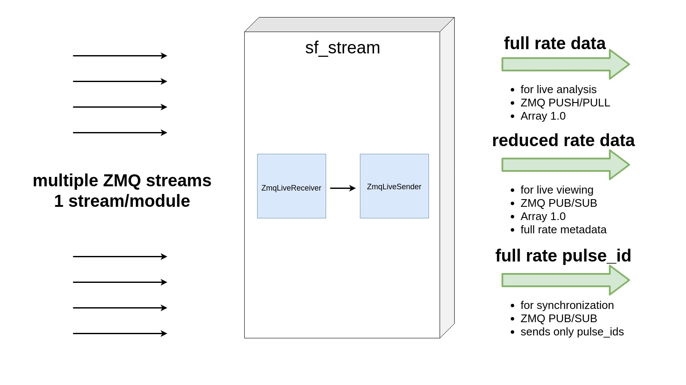

# sf-stream
sf-stream is the component that receives a live stream of frame data from 
sf-buffers over ZMQ and assembles them into images. This images are then 
sent again over ZMQ to external components. There is always only 1 sf-stream 
per detector.

It currently has 3 output streams:

- **Full data full metadata** rate stream (send all images and metadata)
- **Reduced data full metadata** rate stream (send less images, but 
all metadata)
- **Pulse_id** stream (send only the current pulse_id)

In addition to receiving and assembling images, sf-stream also calculates 
additional metadata and constructs the structures needed to send data in 
Array 1.0 protocol.

## Overview

sf-stream is a single threaded application (without counting the ZMQ IO threads)
that is used for providing live assembled images to anyone willing to listen. 

In addition, it also provides a pulse_id stream, which is the most immediate 
pulse_id feedback we currently have in case we need to synchronize external 
components to the current machine pulse_id.

## ZMQ receiving

## Image assembly

## ZMQ sending

### Full data full metadata stream

### Reduced data full metadata stream

### Pulse_id stream